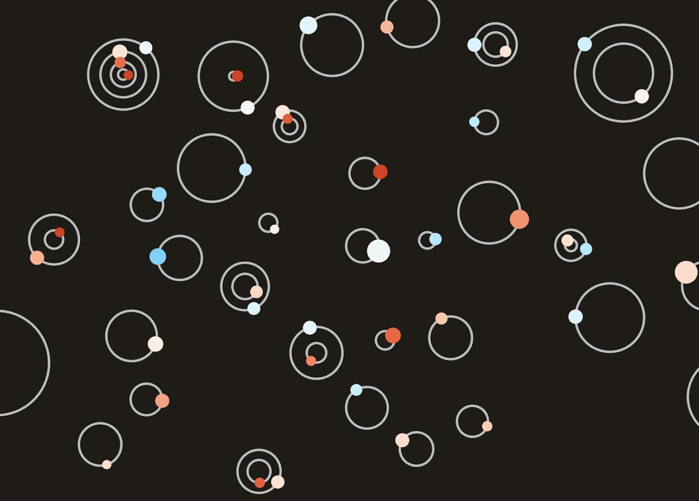
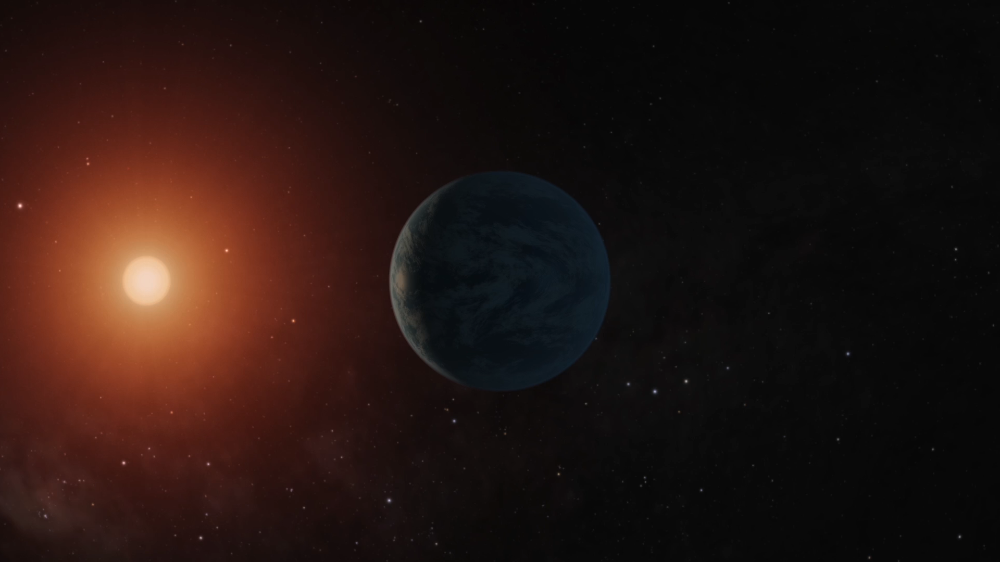
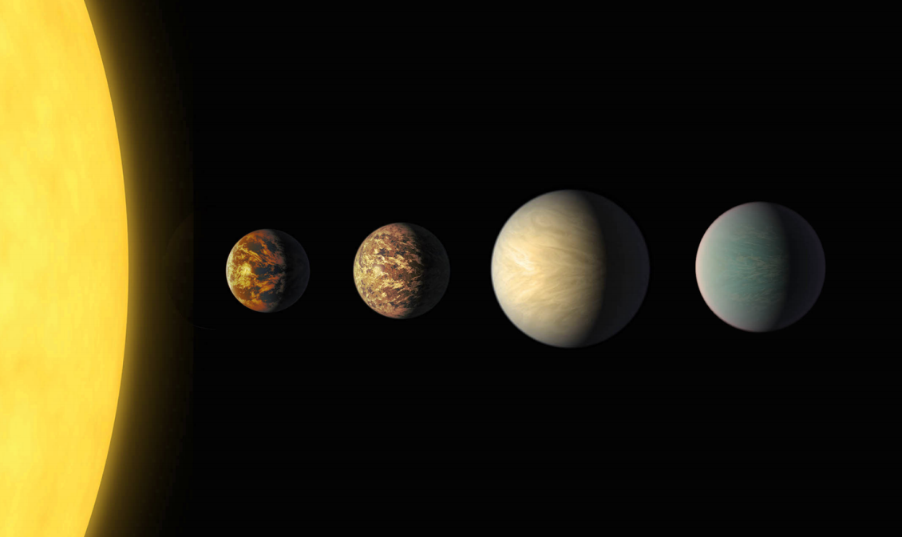

### Click the image above to watch the animation!

## Newly discovered Venus-size planet K2-257 b (artist's impression)

### Image credit: NASA/JPL-Caltech/R. Hurt (IPAC)

## Four small planets orbiting K2-187 (artist’s impression). Click for animation!

### Image credit: NASA/JPL-Caltech/R. Hurt, T. Pyle (IPAC), UTokyo/J. Livingston

## Read the papers [here](https://doi.org/10.3847/1538-3881/aaccde) and [here](http://iopscience.iop.org/article/10.3847/1538-3881/aae778/meta)
